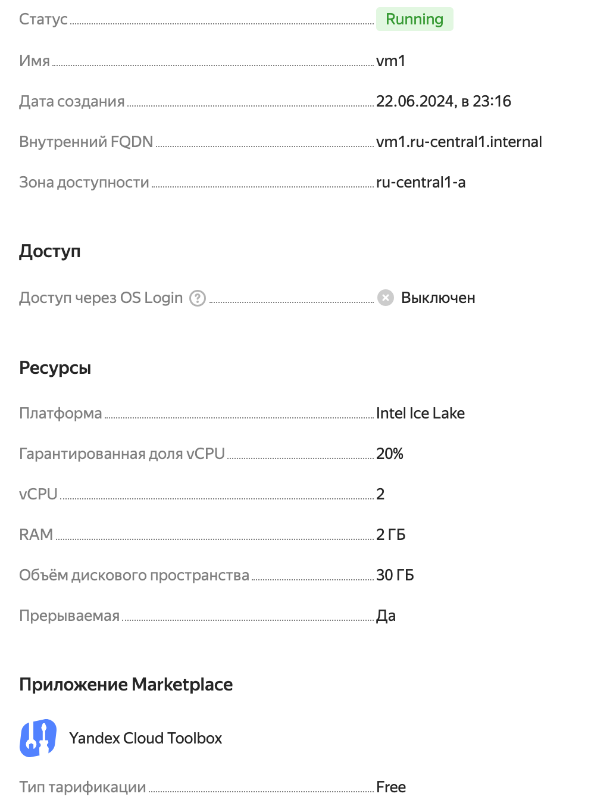
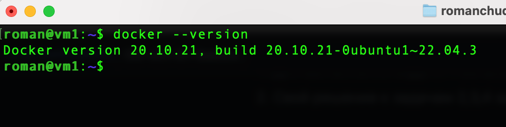

## Задание 1
Создана ВМ:

Версия Docker:

## Задание 2
Для задачи «высоконагруженная база данных MySql, критичная к отказу» можно выбрать тип платформы «паравиртуализация», так как такой тип виртуализации адаптирован под высокоие нагрузки и эффективное использование вычислительных ресурсов.
Для задачи «различные web-приложения» можно выбрать тип платформы «виртаулизация уровня ОС», если приложение на нагруженное, либо «паравиртуализация», если приложение должно выдерживать высокие нагрузки.
Для задачи «Windows-системы для использования бухгалтерским отделом» достаточно виртуализации уровня ОС, тут не нужны какие-то оптимизации производительности.
Для задачи «системы, выполняющие высокопроизводительные расчёты на GPU» можно выбрать тип платформы «физические сервера», чтобы иметь непосредственный доступ к аппаратуре GPU.

## Задание 3
1.	Hyper-V
2.	Xen
3.	VirtualBox
4.	KVM

## Задание 4
1. Сложность управления, настройки и мониторинга
2. Могут быть проблемы с совместимостью при использовании общих ресурсов
3. Использование различных систем управления виртуализацией может увеличить риск возникновения уязвимостей безопасности
4. Сложность восстановления после сбоев
