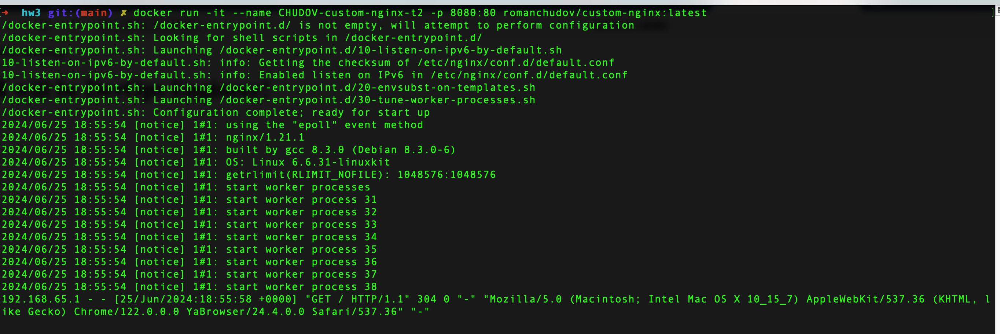
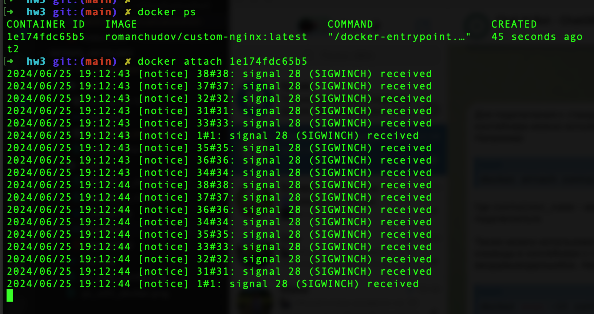
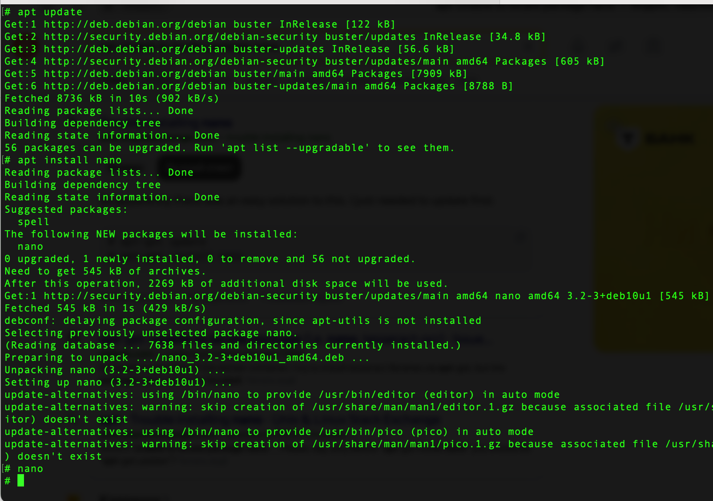
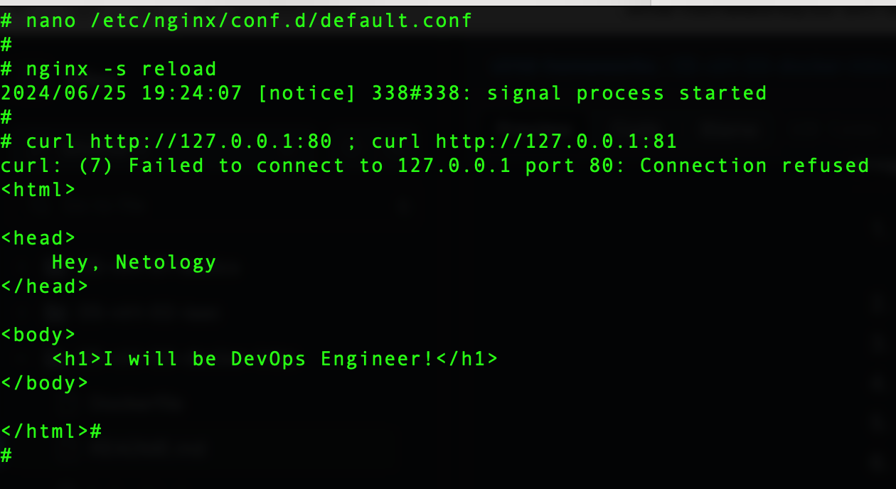
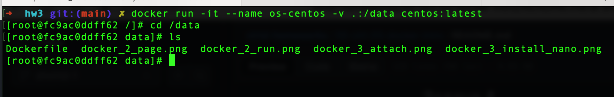
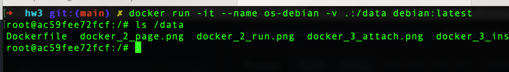

## Задание 1

[custom-nginx](docker.io/romanchudov/custom-nginx)

## Задание 2




## Задание 3

1. docker attach <container ID>



6. Install nano



7-8. Nginx: change port



12. Remove container

```sh
$ docker rm -f CHUDOV-custom-nginx-t2
```

## Задание 4

Centos:



Debian:



## Задание 5

5.1. Будет использовано compose.yaml, т.к. это имя файла имеет наиболее высокий приоритет.

5.2.

[compose.yaml](compose.yaml)

[docker-compose.yaml](docker-compose.yaml)

5.4.

[portainer_change_creds.png](portainer_change_creds.png)

5.5-5.6.

[portainer_nginx_config.png](portainer_nginx_config.png)

5.7.

После удаления compose.yaml контейнер portainer стал "осиротевшим", то есть не имеющим соответствующего конфига.

[docker_compose_orphans.png](docker_compose_orphans.png)
