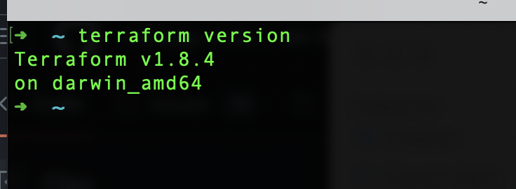
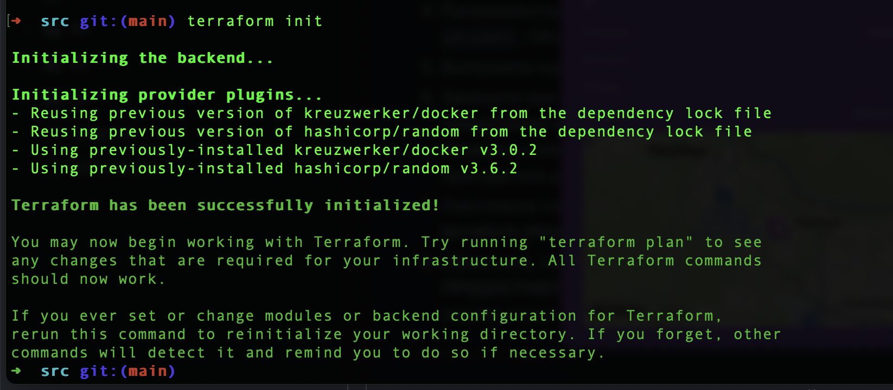
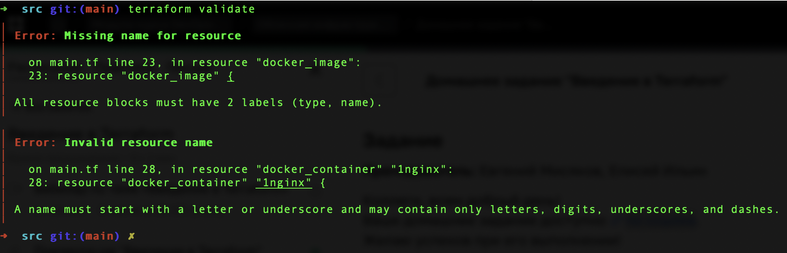
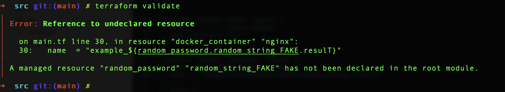
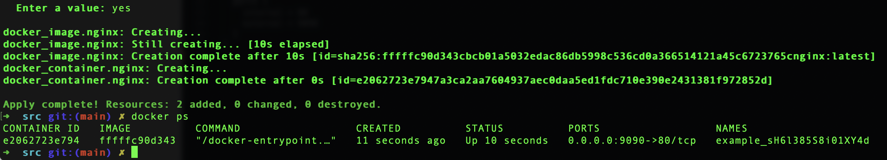
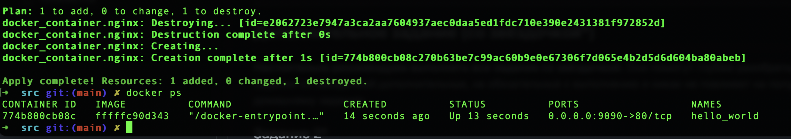
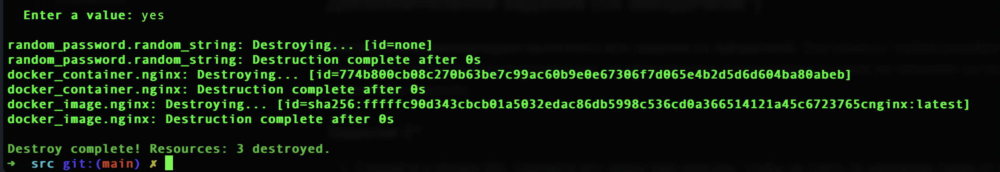

## Задание 1

1.



2. Секретные данные хранятся в `personal.auto.tfvar`

3. `"result": "sH6l385S8i01XY4d"`

4.





`resource "docker_image" {` - пропущен name

`resource "docker_container" "1nginx" {` - невалидный name "1nginx", имена ресурсов не должны начинаться с цифр

`name  = "example_${random_password.random_string_FAKE.resulT}"` - неверное имя ресурса, ошибка в resulT

5.

```
resource "docker_image" "nginx" {
  name         = "nginx:latest"
  keep_locally = true
}

resource "docker_container" "nginx" {
  image = docker_image.nginx.image_id
  name  = "example_${random_password.random_string.result}"

  ports {
    internal = 80
    external = 9090
  }
}
```



6.

`-auto-approve` позволяет пропустить подтверждение изменений.
Опасно может быть, если могут быть ошибочные или неожиданные изменения, можно потерять какие-то данные.
Флаг может быть полезен в случае автоматизации процесса изменений, позволяет ускорить и упростить процессы.




7.



```
{
  "version": 4,
  "terraform_version": "1.8.4",
  "serial": 11,
  "lineage": "d5527178-ca31-9897-b8fe-90b18d4e8caf",
  "outputs": {},
  "resources": [],
  "check_results": null
}
```

8.

Образ не удален из-за того, что в конфигурации указано `keep_locally = true`.
